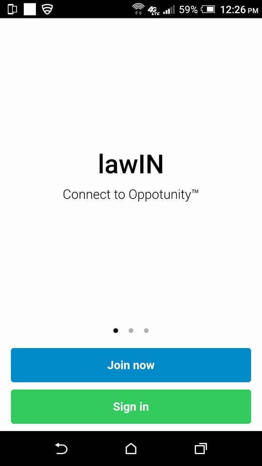
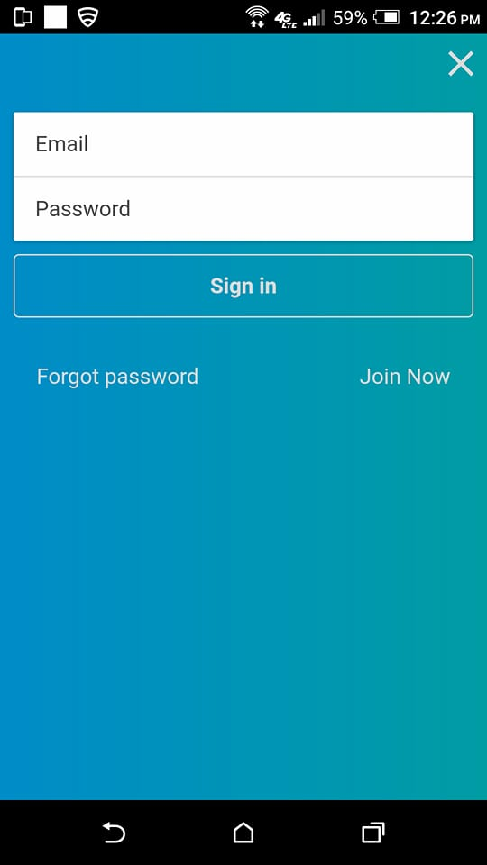
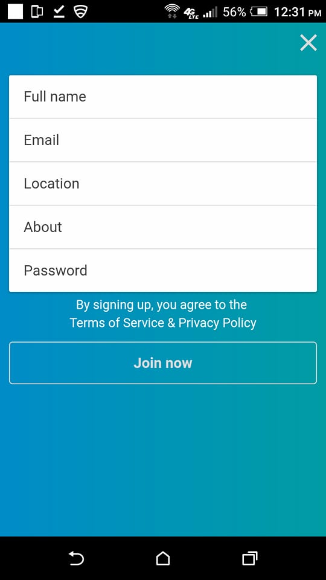
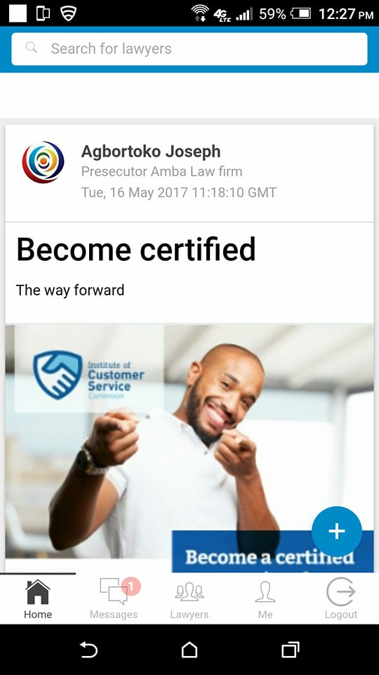
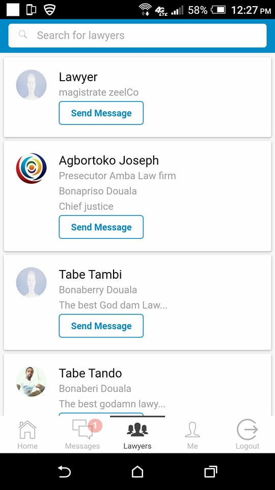
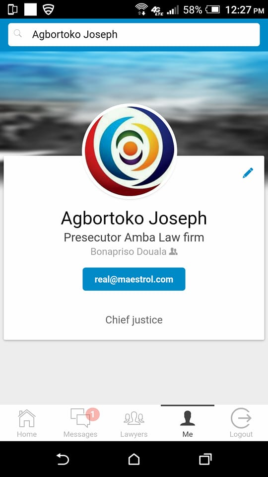

# Lawin Frontend #

The frontend of the Lawin mobile social application for Lawyers built with Ionic.

### What is this repository for? ###

* Quick summary
* Version
* [Learn Markdown](https://bitbucket.org/tutorials/markdowndemo)

### How do I get set up locally? ###

* Install npm
* $ sudo npm install -g ionic
* $ npm install
* $ bower install
* $ ionic serve
* The browser should automatically open the app

### Dependencies ###

* Setup SASS $ ionic setup sass

### Configure Platforms ###
Now, we need to tell ionic that we want to enable the iOS and Android platforms. Note: unless you are on MacOS, leave out the iOS platform:

* $ ionic cordova platform add ios
* ionic cordova platform add android

### Test it out ###
Just to make sure the default project worked, try building and running the project (substitute ios for android to build for Android instead):

* $ ionic cordova build ios
* $ ionic cordova emulate ios

### Proof ###

### Who do I talk to? ###

* Repo owner or admin | tabot.kevin@gmail.com